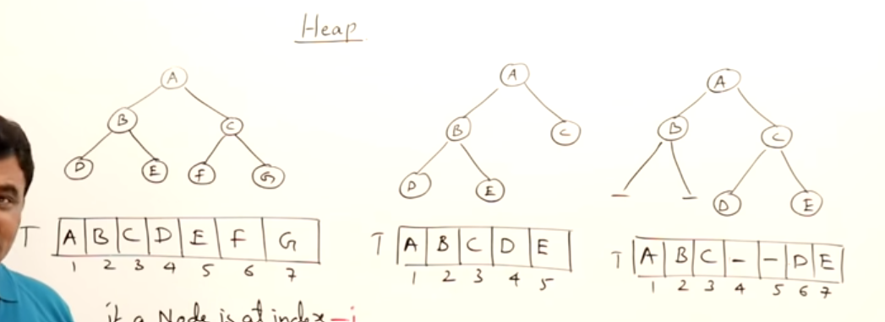

A complete binary tree has all the elements from left to right and when we represent them in a array there are not empty spaces

if we se here the 1st one is complete binary tree the second one too even though the righ child does not have child but left child has child so is complete left to right. the last one is not complete since its not complete left to righ